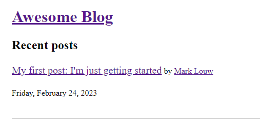

# Build a Blog Using Django, Vue, and GraphQL



## Starting the back-end Django application

In a new terminal tab:

1. Install the back-end requirements in the environment of your choice:
  ```shell
  $ cd /path/to/repo/
  $ python3 -m pip install -r requirements.txt
  ```
2. Create a file called .env in the root of the project and add a secure secret key
```
SECRET_KEY = 'lqhtkx3n6y3%l63fq%90pxk@7#l+jyhz$6a^v%3g)#2o265tk!'
```
3. Create the initial Django database by running migrations:
  ```shell
  $ python manage.py migrate
  ```
4. Create a Django superuser:
  ```shell
  $ python manage.py createsuperuser
  ```
5. Run the Django project (by default on port 8000):
  ```shell
  $ python manage.py runserver
  ```

## Starting the front-end Vue application

In a new terminal tab:

1. Install the front-end requirements:
  ```shell
  $ cd /path/to/repo/tutorial-drafts/articles/django-vue-graphql/source_code/frontend/
  $ npm install
  ```
2. Run the Vue project (by default on port 8080):
  ```shell
  $ npm run serve
  ```

## Add a few posts

1. Visit [the Django admin](https://localhost:8000/admin)
2. Log in using the superuser you created earlier
3. Write a few posts, adding authors and tags as desired
4. Make sure at least one post is `published` (or no posts will appear)

## View the blog

1. Visit [the blog homepage](https://localhost:8080)
2. Browse the posts, tags, and authors

## Try the GraphQL API yourself

1. Visit [the GraphiQL interface](https://localhost:8000/graphql)
2. Create some queries

NOTE: Secret in settings.py should be moved to a seperate .env file
